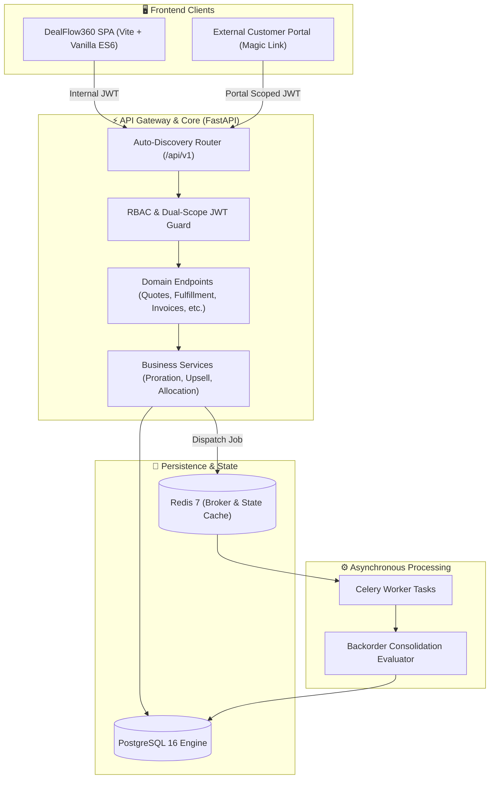

# 🚀 DealFlow360

> **Enterprise-Grade B2B Deal, Quotation & Revenue Orchestration Platform**  
> Streamlining the end-to-end B2B sales lifecycle — from intelligent Configure-Price-Quote (CPQ) and automated approval matrices to multi-warehouse fulfillment, subscription recurring billing, and real-time deal health diagnostics.

---

[](https://fastapi.tiangolo.com)
[](https://python.org)
[](https://www.postgresql.org)
[](https://vitejs.dev)
[](https://redis.io)
[](https://docs.celeryq.dev)
[](https://www.docker.com)
[](LICENSE)

---

## 📖 Table of Contents

- [Executive Overview](#-executive-overview)
- [Key Features & Capabilities](#-key-features--capabilities)
- [System Architecture](#-system-architecture)
- [Technology Stack](#-technology-stack)
- [Role-Based Access Control (RBAC)](#-role-based-access-control-rbac)
- [Repository Structure](#-repository-structure)
- [Meet the Contributors](#-meet-the-contributors)
- [License](#-license)

---

## 🌟 Executive Overview

**DealFlow360** is a centralized revenue engine designed to resolve the friction between sales velocity and operational governance. Modern B2B enterprises often struggle with disconnected CRM systems, siloed warehouse inventories, uncoordinated quoting discounts, and delayed billing reconciliations. 

DealFlow360 bridges these gaps into a cohesive, high-performance platform:

1. **Sales Velocity**: Reps configure quotes with real-time price calculations, tiered discounts, and automated margin-protecting upsell recommendations.
2. **Operational Control**: Multi-warehouse allocation algorithms calculate optimal dispatch routes based on geographic cost weights and warehouse stock levels.
3. **Financial Integrity**: Native invoicing with partial payment tracking, credit notes, dynamic proration for mid-cycle subscription changes, and downloadable PDF summaries.
4. **Customer Transparency**: Dedicated external portal accessible via secure scoped tokens and magic links, allowing buyers to review, negotiate, and approve quotations in real time.

---

## ✨ Key Features & Capabilities

### 💼 Deal & Quotation Lifecycle Management (CPQ)
- **Deterministic State Machine**: Governs quote transitions through `Draft` ➔ `Pending Approval` ➔ `Approved` ➔ `Sent` ➔ `Under Negotiation` ➔ `Confirmed` ➔ `Fulfilled` / `Rejected`.
- **Dynamic Line Calculation**: Automatic recalculation of line totals, multi-tiered discounts, base prices, tax snapshots, and quotation totals.
- **Audit Logging**: Comprehensive, immutable audit trail for every status change, discount override, rep nudge, and fulfillment transition.

### 🛡️ Multi-Tier Approval & Governance
- **Discount & Margin Triggers**: Configurable approval workflows triggered when requested discounts exceed predefined rep tolerances.
- **Sales Manager Console**: Single-click reviews, approvals, and rejections with mandatory rationale logging for strict compliance.

### 📦 Smart Multi-Warehouse Fulfillment & Inventory
- **Weighted Allocation Engine**: Automatically splits quotation line items across multiple fulfillment hubs using shipping cost weights (e.g., North America Hub vs. European Gateway).
- **Stock Reservation & Deduplication**: Real-time locking of quantity-on-hand vs. reserved stock to eliminate overselling.
- **Asynchronous Backorder Consolidation**: Background Celery task triggers upon warehouse replenishment events, flagging open backorders for consolidation and notifying sales reps.

### 💳 Invoicing, Payments & Revenue Billing
- **Full Invoicing Lifecycle**: `Draft` ➔ `Posted` ➔ `Paid` / `Partially Paid` ➔ `Cancelled` / `Overdue`.
- **Flexible Payments**: Support for partial payments, payment receipts, and automated credit note issuance.
- **PDF Generation**: High-fidelity, printable PDF invoices and quotations generated on the fly via ReportLab & FPDF2.

### 🔄 Subscription Management & Proration Engine
- **Cadence Flexibility**: Native support for Monthly, Quarterly, and Annual subscription schedules.
- **Automated Billing Schedules**: Tracks future billing runs, active periods, and renewal statuses.
- **Exact Proration**: Mid-cycle upgrade and downgrade proration algorithms with custom refund rules and immediate credit note adjustments.

### 🩺 Deal Health & Diagnostic Insights
- **Stalled Deal Detection**: Identifies stalled quotes exceeding inactivity thresholds.
- **Discount Anomaly Flags**: Spots quote lines deviating statistically from historical rep averages.
- **Delivery Slippage Alarms**: Tracks slippage on confirmed orders to safeguard SLA compliance.
- **Deal Nudge Action**: Directly trigger rep nudges from the diagnostic console.

### 📈 AI/Heuristic Upsell & Cross-Sell Engine
- **Margin Threshold Filtering**: Suggests catalog add-ons that maximize net margin contribution.
- **One-Click Quotation Upsell**: Adds recommendations directly to existing quotations, intelligently incrementing quantities for existing line items.

### 🌐 Customer Portal & Negotiation Hub
- **Scoped Magic Links**: Lightweight, secure portal access tokens without requiring internal system credentials.
- **Bi-Directional Negotiation**: Customers can submit counter-offers, view historical revisions, send direct messages to account reps, and download official PDF agreements.

---

## 🏛️ System Architecture

DealFlow360 implements a decoupled, event-aware architecture with clean separation of concerns:




---

## 💻 Technology Stack

| Layer | Technologies | Purpose |
|---|---|---|
| **Backend Framework** | [FastAPI](https://fastapi.tiangolo.com/) | High-performance, async-ready Python REST API |
| **ORM & Migrations** | [SQLAlchemy 2.0](https://www.sqlalchemy.org/) & [Alembic](https://alembic.sqlalchemy.org/) | Sync session mapping, schema migration lifecycle |
| **Database** | [PostgreSQL 16](https://www.postgresql.org/) / SQLite | Production ACID relational store (SQLite fallback for tests) |
| **Caching & Message Broker** | [Redis 7](https://redis.io/) | Celery task message broker and transient cache |
| **Task Queue** | [Celery 5.4+](https://docs.celeryq.dev/) | Asynchronous background jobs (backorders, diagnostics) |
| **Frontend Framework** | [Vite](https://vitejs.dev/) + Vanilla Modern JS (ES6+) | Blazing fast SPA with zero bloated framework overhead |
| **UI Design System** | Modern Claymorphism & Glassmorphism | Custom design tokens, Google Fonts (Plus Jakarta Sans, JetBrains Mono) |
| **Authentication** | [python-jose](https://github.com/mpd/python-jose), [Passlib](https://passlib.readthedocs.io/) | Cryptographic JWTs (Internal tokens vs. Portal tokens) |
| **Document Generation** | [ReportLab](https://www.reportlab.com/) & [FPDF2](https://py-pdf.github.io/fpdf2/) | Dynamic PDF invoices, quotation summary exports |
| **Testing** | [Pytest](https://docs.pytest.org/), [HTTPX](https://www.python-httpx.org/) | Automated unit, route-guard, and integration testing |

---

## 🔐 Role-Based Access Control (RBAC)

DealFlow360 enforces strict role segregation. The frontend dynamically renders views according to permissions, while the backend dependencies enforce token checks on every route.

### 🛡️ Workspace Access Matrix

| Role | Dashboard | Quotations | Approvals | Deal Health | Fulfillment | Invoices | Customers | Products | Subscriptions | Reports | Customer Portal |
|---|:---:|:---:|:---:|:---:|:---:|:---:|:---:|:---:|:---:|:---:|:---:|
| **Admin** | ✅ | ✅ | ✅ | ✅ | ✅ | ✅ | ✅ | ✅ | ✅ | ✅ | ❌ |
| **Sales Manager** | ✅ | ✅ | ✅ | ✅ | ❌ | ❌ | ❌ | ❌ | ❌ | ✅ | ❌ |
| **Sales Rep** | ✅ | ✅ | ❌ | ❌ | ❌ | ❌ | ✅ | ✅ | ❌ | ❌ | ❌ |
| **Finance / Ops** | ✅ | ❌ | ✅ | ❌ | ✅ | ✅ | ❌ | ❌ | ✅ | ❌ | ❌ |
| **Customer** | ❌ | ✅ *(Own)* | ❌ | ❌ | ❌ | ❌ | ❌ | ❌ | ❌ | ❌ | ✅ *(Portal)* |

### 🔑 Local Development Accounts

The seed script automatically populates ready-to-test accounts. All default passwords are: `ChangeMe123!`

| Role | Email Address | Description & Primary Testing Focus |
|---|---|---|
| **Admin** | `admin@dealflow360.com` | Unrestricted access across all internal modules and system configurations. |
| **Sales Manager** | `manager@dealflow360.com` | Deal approvals, discount anomaly reviews, pricing overrides, and executive reports. |
| **Sales Rep** | `rep@dealflow360.com` | Quote drafting, customer management, catalog browsing, and AI upsell suggestions. |
| **Finance / Ops** | `finance@dealflow360.com` | Multi-warehouse fulfillment, backorder consolidation, invoicing, and subscription cadences. |
| **Portal Customer** | `customer@dealflow360.com` | External self-service portal, quotation review, counter-offers, and PDF downloads. |


## 📂 Repository Structure

```text
DealFlow/
├── backend/
│   ├── alembic/                       # Alembic database migration scripts
│   ├── app/
│   │   ├── api/
│   │   │   ├── deps.py                # RBAC guards & session dependencies
│   │   │   └── v1/
│   │   │       ├── api.py             # Router auto-discovery engine
│   │   │       └── endpoints/         # Modular endpoint routers
│   │   │           ├── auth.py
│   │   │           ├── billing.py
│   │   │           ├── deal_health.py
│   │   │           ├── fulfillment.py
│   │   │           ├── payments.py
│   │   │           ├── portal.py
│   │   │           ├── reports.py
│   │   │           ├── subscriptions.py
│   │   │           ├── upsell.py
│   │   │           └── warehouses.py
│   │   ├── core/                      # Config, Celery, Redis, Security
│   │   ├── db/                        # Session makers, base models, seed scripts
│   │   ├── models/                    # SQLAlchemy domain models
│   │   ├── services/                  # Core domain logic & calculation engines
│   │   ├── tasks/                     # Celery background tasks
│   │   └── tests/                     # Pytest suite & unit tests
│   ├── .env.example                   # Environment variable template
│   ├── alembic.ini                    # Alembic migration configuration
│   └── requirements.txt               # Backend Python dependencies
│
├── frontend/
│   ├── src/
│   │   ├── components/                # Reusable UI widgets (Navbar, Modals, etc.)
│   │   ├── pages/                     # SPA Page views (Dashboard, Quotations, etc.)
│   │   ├── styles/                    # Claymorphism & theme CSS tokens
│   │   ├── api.js                     # Centralized API fetch layer
│   │   ├── auth.js                    # JWT session & role storage
│   │   ├── router.js                  # Client-side hash router with RBAC guards
│   │   └── main.js                    # Application bootstrap
│   ├── index.html                     # Single Page Application entrypoint
│   ├── package.json                   # Frontend npm configuration
│   └── vite.config.js                 # Vite development & build setup
│
├── docker-compose.yml                 # PostgreSQL + Redis + Celery stack definition
├── NOTES.md                           # Architecture and engineering decision records
└── README.md                          # Project documentation
```

---

## 👥 Meet the Contributors

DealFlow360 is designed, engineered, and maintained by:

<div align="center">

| Contributor | Focus Area |
|:---:|:---|
| **Renish Nagapara**<br>[](https://www.linkedin.com/in/renish-nagapara-597814329/) [](https://github.com/renish7606) | **System Architecture, Core Platform & Security**<br>• Lead architecture, API auto-discovery, and RBAC governance.<br>• Data modeling, Alembic schema lifecycles, and core session handling.<br>• Integration of full-stack services and DevOps deployment. |
| **Devarsh Patel**<br>[](https://www.linkedin.com/in/devarsh-patel-b89699323/) [](https://github.com/devarshpatel122005) | **CPQ, Quotation Lifecycle & Deal Intelligence**<br>• Quotation authoring engine, total recalculations, and state machines.<br>• Deal Health diagnostics (stalled deal detection, anomaly flags).<br>• AI-assisted upsell recommendations & margin optimization rules. |
| **Dhruv Patel**<br>[](https://www.linkedin.com/in/dhruv-patel-87b974303/) [](https://github.com/dhr4328) | **Fulfillment, Warehouses & Background Workers**<br>• Multi-warehouse allocation algorithms & shipping cost weight optimization.<br>• Stock reservation & replenishment event pipelines.<br>• Celery task orchestration for asynchronous backorder consolidation. |
| **Aadhya Dave**<br>[](https://www.linkedin.com/in/aadhya-dave/) [](https://github.com/AadhyaDave) | **Invoicing, Subscription Billing & Customer Portal**<br>• Billing lifecycle, partial payments, credit notes, and automated PDF export.<br>• Subscription recurring cadence scheduler and daily proration calculations.<br>• Dual-token customer negotiation portal & interactive messaging. |

</div>

---

## 📄 License

This project is licensed under the **MIT License** — see the [LICENSE](LICENSE) file for full details.

---

<div align="center">
  <sub>Built with ❤️ for scalable enterprise commerce and intelligent deal orchestration.</sub>
</div>
