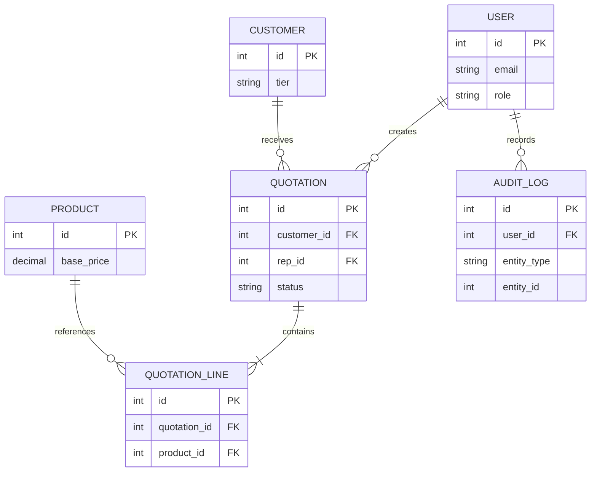

# DealFlow360

DealFlow360 is a shared FastAPI foundation for B2B sales teams. It includes only the core model, authentication, roles, database setup, and background-job scaffolding.

## Local setup

Create `backend/.env` from `backend/.env.example`, add your PostgreSQL URL and JWT secret, install `backend/requirements.txt`, then run commands from `backend/`.

```powershell
alembic upgrade head
python -m app.db.init_db
uvicorn app.main:app --reload
```

`alembic upgrade head` creates the core tables. `python -m app.db.init_db` safely adds local sample data and can be run more than once. The sample user password is `ChangeMe123!`; change it outside local development.

### Local sample accounts

All local sample accounts use password `ChangeMe123!`:

| Role | Email |
| --- | --- |
| Admin | `admin@dealflow360.com` |
| Sales Rep | `rep@dealflow360.com` |
| Sales Manager | `manager@dealflow360.com` |
| Finance / Operations | `finance@dealflow360.com` |
| Customer Portal User | `customer@dealflow360.com` |

### Workspace access matrix

- Sales Rep: Dashboard, Quotations, Customers, Products
- Sales Manager: Dashboard, Quotations, Approvals, Pricing, Reports
- Finance / Operations: Dashboard, Approvals, Fulfillment, Invoices, Subscriptions
- Admin: all internal workspace tabs
- Customer: My Quotations, Messages, Profile
- External portal users: quotation portal only; no internal workspace tabs

## Endpoint auto-include

Add a Python file under `app/api/v1/endpoints/` and export `router = APIRouter(...)`. The version-one API discovers and includes it automatically, so teams do not edit one shared router file.

## Roles and portal access

Use `Depends(require_role("Admin"))` for an internal-only role check. Import `require_role` from `app.core.rbac`.

Use `Depends(require_portal_scope)` for a portal endpoint. Import it from `app.api.deps`. Portal tokens have `scope: "portal"`; they are rejected by internal dependencies, and internal tokens are rejected by portal dependencies.

Redis and Celery are scaffolding only. Use `get_redis()` from `app.core.redis_client` for future cache work and import `celery_app` from `app.core.celery_app` before adding future tasks.

## Core ER diagram



Extension points: the Discount and Approval teams can attach their tables to `Quotation` and `QuotationLine`; Pricing can extend `Product`; fulfillment can attach to confirmed `Quotation`; billing can attach invoice and payment tables to `Customer`/`Quotation`; portal teams can attach customer-facing records to `Customer` and `Quotation`. Those tables are intentionally not part of this foundation.
